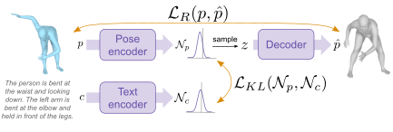

# Text-conditioned Generative Model for 3D Human Poses

 _:exclamation: In what follows, command lines are assumed to be launched from `./src/text2pose`._

## :crystal_ball: Demo

To generate poses based on a pretrained model and your own input description, run the following:

```
streamlit run generative/demo_generative.py -- --model_path </path/to/model.pth>
```

*You can also define the number of pose to generate with* `--n_generate`.

## :bullettrain_front: Train & :dart: Evaluate

Train, then eval, on automatically generated captions:
```
bash generative/script_generative.sh -a train-eval -c gen_glovebigru_vocA1H1_dataA1
```

Finetune, then eval, on human-written captions:
```
bash generative/script_generative.sh -a train-eval -c gen_glovebigru_vocA1H1_dataA1ftH1
```

**Possible arguments are:**
- `-a` (*action*): `train`, `eval` or `train-eval` (to eval directly after training).
- `-c` (*config*): shortname for the experiment and model to run. Configs are detailed in the script.
- `-s` (*seed*; optional): seed value, for reproducibility; useful to distinguish between different runs of a same model.

**Important note**: several evaluation metrics for the generative models rely on retrieval models (fid, mRecall R/G, mRecall G/R).

## Model overview


## Generate and visualize pose samples for the dataset

Pose samples for each caption of the dataset are automatically generated by the model during the evaluation step in *generative/script_generative.sh*. Specifically, the script runs the following command:

```
python generative/generate_poses.py --model_path <model_path> 
```

The generated pose samples can be visualized, along with the original pose and the related description, by running the following:

```
streamlit run generative/look_at_generated_pose_samples.py -- --model_path <model_path> --dataset_version <dataset_version> --split <split>
```