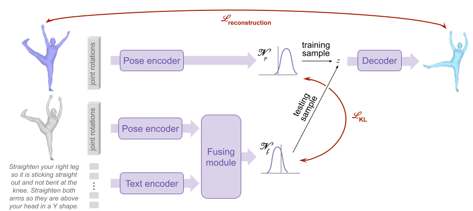

# Text-guided 3D Human Pose Editing Model

_:warning: In what follows, command lines are assumed to be launched from `./src/text2pose`._

_:warning: The evaluation of this model relies partly on a [text-to-pose retrieval model](../retrieval/README.md), see section **Extra setup**, below._

## Model overview

* **Inputs (#2)**: 3D human pose + text modifier;
* **Output**: 3D human pose.



## :crystal_ball: Demo

To edit poses based on a pretrained model and example pairs of pose and (modifyable) modifier texts, run the following:

```
streamlit run generative_B/demo_generative_B.py -- --model_paths </path/to/model.pth>
```

:bulb: Tips: _Specify several model paths to compare models together._

## Extra setup

At the beginning of the bash script, assign to variable `fid` the shortname of the trained [text-to-pose retrieval model](../retrieval/README.md) to be used for computing the FID.

Add a line in *shortname_2_model_path.txt* to indicate the path to the model corresponding to the provided shortname.

## :bullettrain_front: Train

:memo: Modify the variables at the top of the bash script to specify the desired model & training options.


Then use the following command:
```
bash generative_B/script_generative_B.sh 'train' <training phase: pretrain|finetune> <seed number>
```

## :dart: Evaluate

Use the following command:
```
bash generative_B/script_generative_B.sh 'eval' </path/to/model.pth>
```