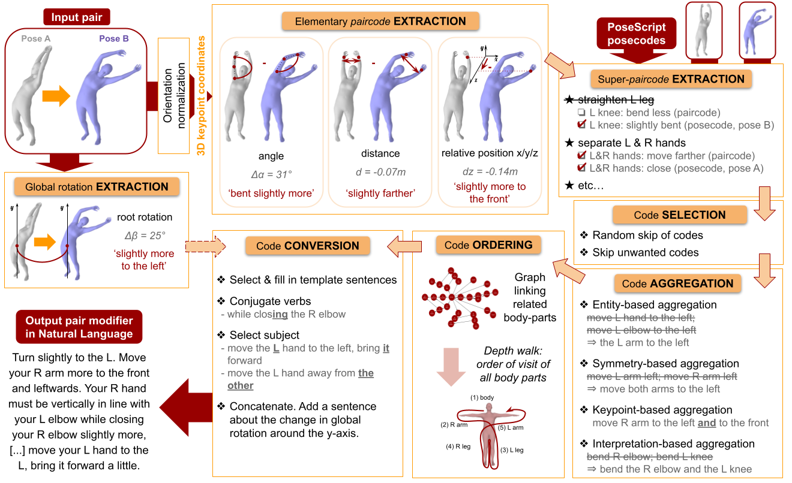

# About the PoseFix dataset

## :inbox_tray: Download

**License.**
*The PoseScript dataset is licensed under the Creative Commons Attribution-NonCommercial-ShareAlike 4.0 license.
A summary of the CC BY-NC-SA 4.0 license is located [here](https://creativecommons.org/licenses/by-nc-sa/4.0/).
The CC BY-NC-SA 4.0 license is located [here](https://creativecommons.org/licenses/by-nc-sa/4.0/legalcode).*

| Version | Link |
|---|---|
| ICCV23 | [download](https://download.europe.naverlabs.com/ComputerVision/PoseFix/posefix_dataset_release.zip) |

<details>
<summary>Dataset content.</summary>

* a file linking each pose ID to the reference of its corresponding pose sequence in AMASS, and its frame index;
* a file linking each pair ID (index) to a pair of pose IDs;
* a file linking each pair ID with its text modifiers (separate files for automatically generated modifiers, human-written ones and paraphrases);
* files listing pair IDs for each split.

Please refer to the provided README for more details.
</details>


## :crystal_ball: Take a quick look

To take a quick look at the data (ie. look at the poses under different viewpoints, the human-written modifier and the paraphrases collected with InstructGPT when available, as well as the automatic modifiers):

```
streamlit run posefix/explore_posefix.py
```

## :page_with_curl: Generate automatic modifiers

### Overview of the pipeline

Given a pair of 3D poses, we use paircodes to extract semantic pair-relationship information, and posecodes for each of the two poses to enrich the instructions with "absolute" information. These codes are then selected, merged or combined (when relevant) before being converted into a structural instruction in natural language explaining how to go from the first pose to the second pose. Letters ‘L’ and ‘R’ stand for ‘left’ and ‘right’ respectively.



Please refer to the paper and the supplementary material for more extensive explanations.

### Generate modifiers

To generate automatic modifiers, please follow these steps:

- **compute joint coordinates for all poses**
	```
	python posescript/compute_coords.py
	```

- **compute rotation change for all pairs**
	```
	python posefix/compute_rotation_change.py
	```

- (optional) **modify corrective data as you see fit**:
	
    (Re)Define posecodes & paircodes (categories, thresholds, tolerable noise levels, eligibility), super-posecodes & super-paircodes, template sentences and so forth by modifiying both *posescript/captioning_data.py* and *posefix/corrective_data.py*. The data structures are extensively explained in these files, and one can follow some marks (`ADD_VIRTUAL_JOINT`, `ADD_POSECODE_KIND`, `ADD_SUPER_POSECODE`, `ADD_PAIRCODE_KIND`, `ADD_SUPER_PAIRCODE`) to add new instruction material. Note that some posecodes (initially created for [single pose description](../posescript/README.md)) are also used in this pipeline.

- **generate automatic modifiers**

	*Possible arguments are:*
    - `--saving_dir`: general location for saving generated instructions and data related to them (default: *<POSEFIX_LOCATION>/generated_instructions/*)
    - `--version_name`: name of the version. Will be used to create a subdirectory of `--saving_dir` in which to save all files (instructions & intermediary results). Default is 'tmp'.
	- `--simplified_instructions`: produce a simplified version of the instructions (basically: no aggregation, no randomly referring to a body part by a substitute word).
    - `--random_skip`: randomly skip some non-essential (ie. not so rare) posecodes & paircodes.

	<br>

    For instance, modifiers can be generated using the following command:
    ```
    python posefix/correcting.py --version_name <version name> --random_skip
    ```
	
    To work on a small subset, one can use the following command:
    ```
	python posefix/correcting.py --debug
    ```
    and specify which pair to study by modifying the list of pair IDs marked with `SPECIFIC_INPUT_PAIR_IDS` in *posefix/correcting.py*.

	<details>
	  <summary>To generate caption versions similar to the ICCV 2023 paper (posefix-A):</summary>

	| Version | Command |
	|---------|---------|
	| pfA       | `python posefix/correcting.py --version_name captions_pfA` |
	| pfB       | `python posefix/correcting.py --version_name captions_pfB --random_skip` |
	| pfC       | `python posefix/correcting.py --version_name captions_pfC --random_skip --simplified_captions` |
	</details>

## Citation

If you use this code or the PoseFix dataset, please cite the following paper:

```bibtex
@inproceedings{delmas2023posefix,
  title={{PoseFix: Correcting 3D Human Poses with Natural Language}},
  author={{Delmas, Ginger and Weinzaepfel, Philippe and Moreno-Noguer, Francesc and Rogez, Gr\'egory}},
  booktitle={{ICCV}},
  year={2023}
}
```

Please also remember to follow AMASS's respective citation guideline if you use the AMASS data.
