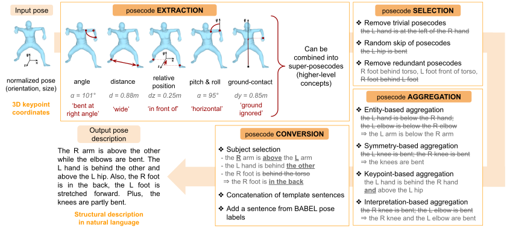

# About the PoseScript dataset

## :inbox_tray: Download

The PoseScript dataset can be downloaded [here](https://download.europe.naverlabs.com/ComputerVision/PoseScript/posescript_dataset_release.zip). Please refer to the provided README for more information about its content.

## :crystal_ball: Take a quick look

To take a quick look at the data (the pose under a few different viewpoints, the human-written caption when available, and the automatic captions):

```
streamlit run posescript/explore_posescript.py
```

## :page_with_curl: Generate automatic captions

To generate automatic captions, please follow these steps:

- **compute joint coordinates for all poses** _(~ 20 min)_
	```
	python posescript/compute_coords.py
	```

- **get and format BABEL labels for poses in PoseScript** _(~ 5 min)_
	```
	python posescript/format_babel_labels.py
	```	

- (optional) **modify captioning data as you see fit**:
	- look at diagrams on posecode statistics by running the following:
		```
		python posescript/captioning.py --action posecode_stats --version_name posecode_stats
		```
		This is helpful to decide on posecode eligibility.
	- (re)define posecodes (categories, thresholds, tolerable noise levels, eligibility), super-posecodes, ripple effect rules based on statistics, template sentences and so forth by modifiying *posescript/captioning_data.py*. The data structures are extensivey explained in this file, and one can follow some marks (`ADD_VIRTUAL_JOINT`, `ADD_POSECODE_KIND`, `ADD_SUPER_POSECODE`) to add new captioning material.


- **generate automatic captions** _(~ 1 min = 20k captions, with 1 cap/pose)_

	*Possible arguments are:*
    - `--saving_dir`: general location for saving generated captions and data related to them (default: *<POSESCRIPT_LOCATION>/generated_captions/*)
    - `--version_name`: name of the caption version. Will be used to create a subdirectory of `--saving_dir` in which to save all files (descriptions & intermediary results). Default is 'tmp'.
	- `--simplified_captions`: produce a simplified version of the captions (basically: no aggregation, no omitting of some support keypoints for the sake of flow, no randomly referring to a body part by a substitute word). This configuration is used to generate caption versions E and F from the paper.
    - `--apply_transrel_ripple_effect`: discard some posecodes using ripple effect rules based on transitive relations between body parts.
    - `--apply_stat_ripple_effect`: discard some posecodes using ripple effect rules based on statistically frequent pairs and triplets of posecodes.
    - `--random_skip`: randomly skip some non-essential posecodes (ie. posecodes that were found to be satisfied by more than 6% of the 20k poses considered in PoseScript).
    - `--add_babel_info`: add sentences using information extracted from BABEL.
    - `--add_dancing_info`: add a sentence stating that the pose is a dancing pose if it comes from DanceDB (provided that `--add_babel_info` is also set to True.
	
	To generate the different caption versions as in the paper:

	| Version | Command |
	|---------|---------|
	| A       | `python posescript/captioning.py --version_name captions_A --apply_transrel_ripple_effect --apply_stat_ripple_effect --random_skip --add_babel_info --add_dancing_info` |
	| B       | `python posescript/captioning.py --version_name captions_B --random_skip --add_babel_info --add_dancing_info` |
	| C       | `python posescript/captioning.py --version_name captions_C --random_skip --add_babel_info` |
	| D       | `python posescript/captioning.py --version_name captions_D --random_skip` |
	| E       | `python posescript/captioning.py --version_name captions_E --random_skip --simplified_captions` |
	| F       | `python posescript/captioning.py --version_name captions_F --simplified_captions` |


## About the captioning pipeline

Given a normalized 3D pose, we use posecodes to extract semantic pose information. These posecodes are then selected, merged or combined (when relevant) before being converted into a structural pose description in natural language. Letters ‘L’ and ‘R’ stand for ‘left’ and ‘right’ respectively.



Please refer to the paper and the supplementary material for more extensive explanations.

## Citation

If you use this code or the PoseScript dataset, please cite the following paper:

```
@inproceedings{posescript,
  title={{PoseScript: 3D Human Poses from Natural Language}},
  author={{Delmas, Ginger and Weinzaepfel, Philippe and Lucas, Thomas and Moreno-Noguer, Francesc and Rogez, Gr\'egory}},
  booktitle={{ECCV}},
  year={2022}
}
```

Please also remember to follow AMASS' and BABEL's respective citation guideline if you use the AMASS or BABEL data respectively.

## License

The PoseScript dataset is licensed under the Creative Commons Attribution-NonCommercial-ShareAlike 4.0 license.

A summary of the CC BY-NC-SA 4.0 license is located here:
	https://creativecommons.org/licenses/by-nc-sa/4.0/

The CC BY-NC-SA 4.0 license is located here:
	https://creativecommons.org/licenses/by-nc-sa/4.0/legalcode

